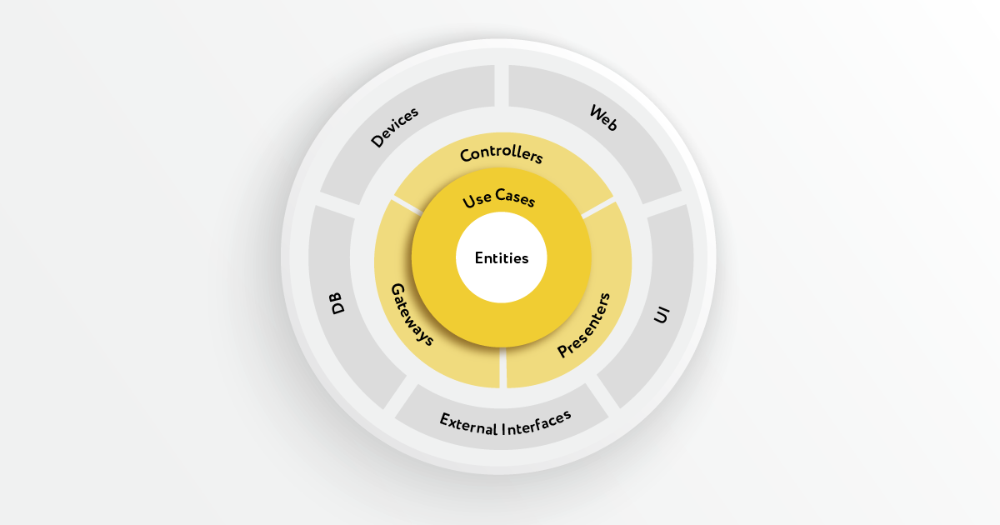

# Супер Лабораторная работа 2
___
## В чем суть?
Для того, чтобы веб-сервис можно было развивать, нужно правильным образом организовывать код внутри него.
В предыдущей лабораторной работе организация кода позволяла нам познакомиться с основными особенностями фреймворка flask, однако она никуда не годится в плане разработки полноценного продукта.

## Как мне правильно организовать свой код?
### Во-первых, правильно работаем с зависимостями!

- В центре круга находятся бизнес-правила. Что такое бизнес-правила?
На примере банка это, могут быть правила о том, под какой процент нужно выдавать кредит, каким критериям должен удовлетворять заемщик и т.п.
Как вы можете заметить, у нас бизнес правил пока что нет.
Главное свойство бизнес правил в том, что они должны быть чисты от сторонних модулей.
Иными словами, остальные модули должны импортировать ваши бизнес-правила и использовать, а бизнес правила должны быть чисты от импортов.

- Далее вокруг бизнес правил находится ядро т.н. "Вариантов использования".
Что это такое? Это бизнес-правила, которые относятся конкретно к вашей информационной системе.
На примере банка это могут быть правила о том, что нельзя показывать пользователю график платежей до того, как он заполнил все необходимые поля с информацией.
Данный слой может импортировать классы бизнес-правил.

- Вокруг них находятся презентаторы (контроллеры без логики), контроллеры, шлюзы и т.п.
Здесь сконцентрирован код, который находится перед переферией (вводом-выводом) и, грубо говоря, просто связывает все воедино.
Данный слой может импортировать классы бизнес-правил и "вариантов использования".

- На внешнем слое находится вся периферия и конкретика: пользовательский интерфейс, общение с базой данных, внешние API, web-интерфейсы и т.п.
### Запомним, чем дальше код от ввода и вывода, тем он ближе к центру!

Таким образом, если вы меняете бизнес-правила, то это влияет на всю систему.
Если вы меняете прикладные бизнес правила, то это не влияет на чистые бизнес-правила, зато влияет на основную систему.
Если вы меняете что-то на переферии, то это никак не влияет на систему в целом.

### Соблюдайте чистоту кода! 
- Имена должны передавать намерения программиста, выбирайте информативные имена.
- Избегайте дезинформации, не надо создавать одинаковые трудноразличимые названия.
- Используйте осмысленные различия в названиях, избегайте избыточности.
- Выбирайте имена, удобные для поиска.
- Имена классов должны быть комбинацией имен существительных.
- Имена функций должны содержать глаголы и ключевые слова.
- Ваши функции должны быть компактны.
- Одна функция - одна операция (того или иного уровня абстрации).
- Функцию, выполняющую только одну операцию, невозможно осмысленно разделить на секции. В функциях не должно быть секций.
- Ваш код должно быть возможно прочитать сверху вниз. (соблюдайте порядок функций)
- В идеальном случае количество аргументов функции равно нулю, допускаются функции с одним, двумя аргументами. Функций с тремя аргументами следует по возможности избегать.
- Не используйте в функциях аргументы-флаги, лучше разделите функцию на несколько обособленных функций.
- Функция должна либо изменять состояние объекта, либо возвращать информацию об этом объекте.
- Выносите обработку ошибок в отдельную функцию.

Соблюдая все вышеперечисленные правила, вы добьетесь того, что ваш код будет возможно легко прочитать и легко изменить.

## Что изменилось в веб-сервисе?
В наш веб-сервис пришел специалист по архитектуре и чистоте кода и перед развитием проекта решил внести свои коррективы.
Сервис был реорганизован согласно модели MVC, код был почищен, некоторые функции в контроллере разделены, маршруты были вынесены в отдельный файл при помощи blueprint, функции сборки ответов и ракции на запросы были вынесены в контроллер, на данном этапе осталось сделать последний рывок - перенести код работы с базой данных из контроллера в модель.

## Что нужно сделать?
- Просмотрите проект, оцените изменения, если вам что-то непонятно, разберитесь с этим с помощью гугла.
- Разверните его как в прошлой лабораторной.
- Откройте файл с контроллером (controllers/main_controller.py) и найдите код который нужно перенести.
- Откройте файл с моделью posts (models/posts.py), создайте там функции под перенос кода
- Перенесите весь необходимый код в модель
- Импортируйте созданные вами функции в контроллере, вызовите их в нужных местах.
- Перезапустите сервер, откройте сервис, протестируйте его работу, поздравляю, вы восхитительны!

ПыСы Вы могли заметить, что мы импортируем код общения с БД в контроллер, хотя нужно делать наоборот. Мы разворачиваем зависимости в обратном направлении с помощью абстрактных классов, но пока что оставим все так как есть, чтобы не запутаться.